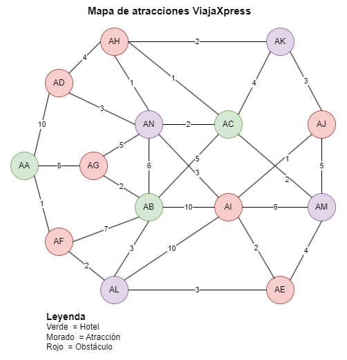

# Proyecto de investigación - Haskell

> Octubre de 2023

## Paradigmas de programación

## Integrantes

- Isaac Fabián Palma Medina
- Karla Verónica Quiros Delgado

## Descripción del Proyecto

Este repositorio tiene como objetivo proporcionar una visión completa de las funcionalidades del lenguaje de programación **Haskell**. Además de la creación de una UI que permita al usuario interactuar con el programa, en **Python**.

## Ejemplo

### Problema

La empresa **ViajaXpress** necesita un sistema que permita a sus clientes planificar su ruta de viaje. Para lograrlo, el cliente puede elegir entre las siguientes opciones:

- **Hoteles.**
- **Atracciones.**

Además, pueden encontrarse con **Obstáculos** en el camino. El objetivo es proporcionar al cliente la mejor ruta posible, al mejor precio, ¡incluso permitiendo que visite más de una atracción!

La distribución actual de los **Lugares** es la siguiente:

### Ejecución de la solución

1. Tener instalado [Haskell](https://www.haskell.org/ghcup/).
2. Clonar el repositorio y acceder a la carpeta del proyecto.
3. Acceder a la carpeta `ui`.
4. Ejecutar el comando `python -m venv env`.
5. Ejecutar el comando `source env\Scripts\activate` o `env\Scripts\activate.bat`.
6. Ejectuar el comando `pip install -r requirements.txt`.
7. Correr el archivo `run.sh` en una terminal Bash.

## Referencias

Lipovača, M. (2011). *Learn You a Haskell for Great Good!*. Recuperado de: http://learnyouahaskell.com/chapters
